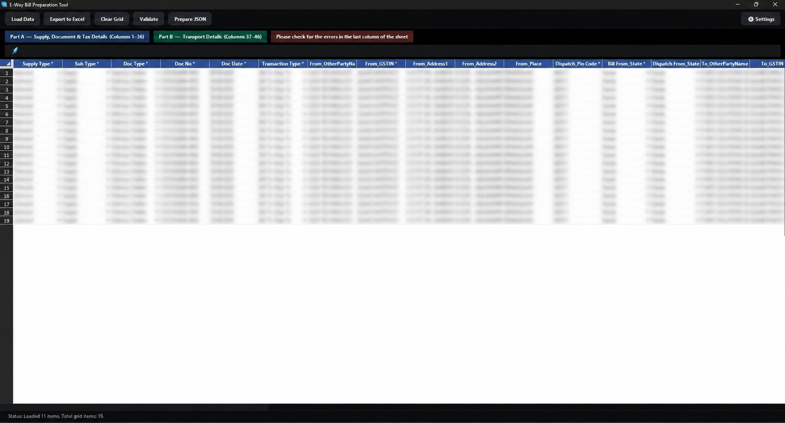
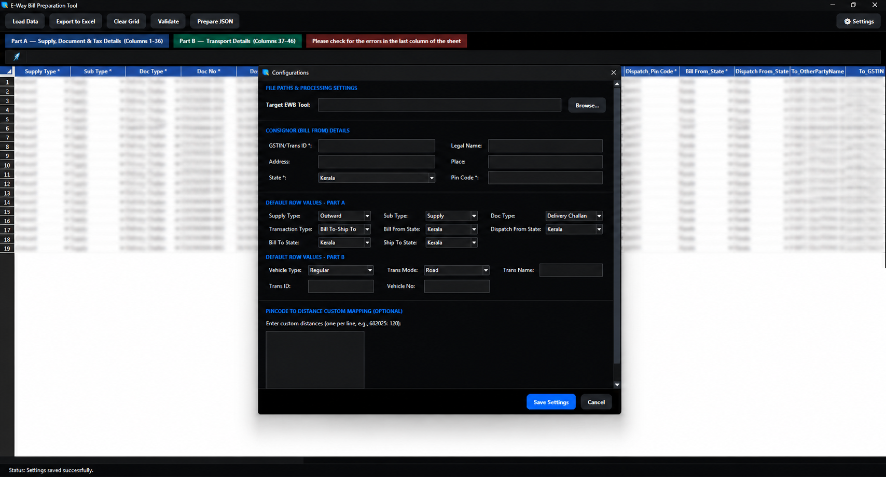

# 🚀 E-Way Bill Preparation Tool

A professional, high-performance desktop application built with Python and Tkinter for extracting delivery challans (DCs), validating invoice datasets, and preparing bulk-upload JSON files compatible with the Government E-Way Bill Portal.

---

## ✨ Features

- **📂 Direct Data Loading:** Instantly load source Challan Excel files directly from your system via a native file selector dialog.
- **🛡️ Intelligent Duplicate Checking:** Automatic checks for duplicate file path selections and duplicate Document (DC) numbers inside the spreadsheet grid to prevent data repetition.
- **📊 Interactive Data Grid:** Powered by `tksheet` with custom dark styling, cell validation editing, formula entry support, and a complete Undo/Redo stack.
- **🔍 Real-Time Validation:** One-click validation mapping that checks for missing fields, correct HSN formats (4-8 digits), assessable value limits, tax rates, vehicle formatting, and more.
- **📄 Custom Validation Dialogs:** Native-looking, beautifully-designed custom warning popups for validation fails and successes.
- **⚙️ Configurable Default Settings:** Compact, horizontal 3-column settings panel displaying consignor information, vehicle details, default states, and custom pincode-to-distance mappings.
- **💎 Premium Dark Theme:** Beautiful, eye-friendly flat dark user interface layout.

---

## 📸 Screenshots

### Main Interface


### Configurations Panel


---

## 🛠️ Tech Stack

- **Language:** Python 3
- **GUI Framework:** Tkinter (with custom ttk styles and custom modern widgets)
- **Data Table Engine:** `tksheet`
- **Excel Reader/Writer:** `openpyxl`
- **Image Processing:** `Pillow` (PIL)
- **Build Tool:** `PyInstaller` (Standalone Single-File Executable compilation)

---

## 🚀 Getting Started

### 📋 Prerequisites

Ensure you have Python 3.8+ installed on your machine. You can install all project dependencies by running:

```bash
pip install -r requirements.txt
```

### 💻 Running the Application

To run the Python application directly:

```bash
python extract_gui.py
```

---

## 📦 Compiling to Standalone Executable (.exe)

You can compile this project into a standalone Windows executable (`E-Way_Bill_Preparation_Tool.exe`) using PyInstaller. Run the following command in your terminal:

```bash
py -m PyInstaller --onefile --noconsole --name="E-Way_Bill_Preparation_Tool" --icon="app_icon.ico" --add-data="app_icon.ico;." --add-data="rocket_icon.png;." extract_gui.py
```

After compilation, the single-file executable will be available inside the `dist/` directory.

---

## 📂 Project Structure

```
├── extract_gui.py          # Main application source code
├── requirements.txt        # Python library dependencies
├── .gitignore              # Git ignore rules for cached/local files
├── app_icon.ico            # Windows executable & window title icon resource
├── rocket_icon.png         # Colored rocket indicator icon for the formula bar
└── README.md               # Project documentation
```

---

## 📄 License

This project is licensed under the MIT License.
